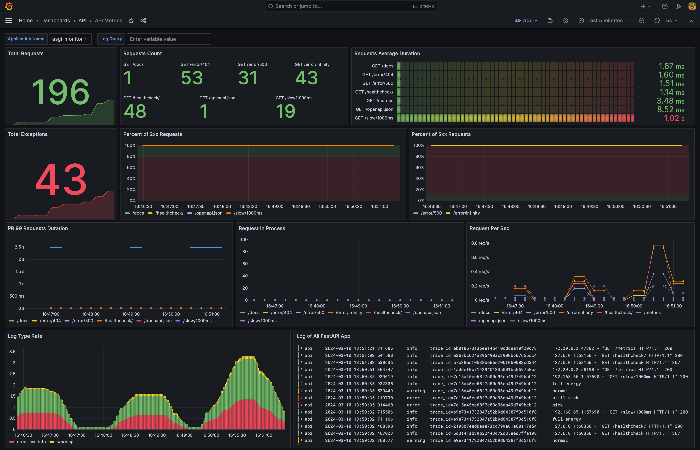
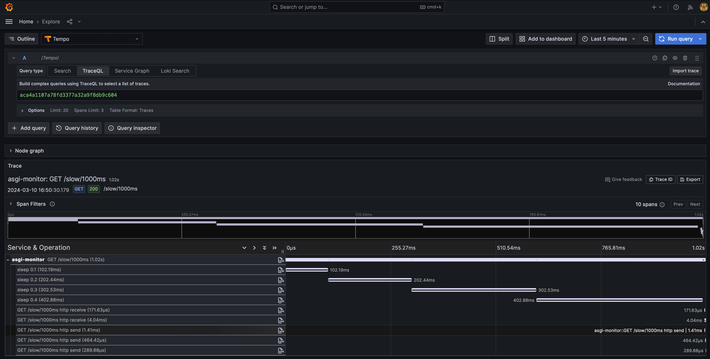

<div align="center">
  <pictire>
    
  </pictire>

  <hr>

  [](https://pypi.python.org/pypi/asgi-monitor)
  [](https://github.com/draincoder/asgi-monitor/actions/workflows/ci.yaml)
  [](https://pypi.python.org/pypi/asgi-monitor)
  [](https://pypistats.org/packages/asgi-monitor)
  [](https://github.com/draincoder/asgi-monitor/blob/master/LICENSE)

</div>

## asgi-monitor
### A library for easy and fast configuration of logging, tracing and metrics for ASGI applications.

### Purpose

Quickly add minimal features for flexible application monitoring.

Features:
 - [Prometheus](https://prometheus.io) metrics
 - [OpenTelemetry](https://opentelemetry.io) traces
 - [Structlog](https://www.structlog.org/) logging with native **logging** module support
 - Integrations with [FastAPI](https://fastapi.tiangolo.com) and [Starlette](https://www.starlette.io)
 - Logging support for [Uvicorn](https://www.uvicorn.org) and [Gunicorn](https://gunicorn.org) with custom **UvicornWorker**

> **Info**
>
> At this stage, the library is being tested and be careful in using it,
> your participation in the development will be appreciated!


### Installation

```shell
pip install asgi-monitor
```

### Quickstart

#### Logging and metrics

```python
import logging

from asgi_monitor.integrations.fastapi import setup_metrics
from asgi_monitor.logging import configure_logging
from asgi_monitor.logging.uvicorn import build_uvicorn_log_config
from fastapi import FastAPI
from uvicorn import run

logger = logging.getLogger(__name__)
app = FastAPI(debug=True)


def run_app() -> None:
    log_config = build_uvicorn_log_config(level=logging.INFO, json_format=True, include_trace=False)

    configure_logging(level=logging.INFO, json_format=True, include_trace=False)
    setup_metrics(app, app_name="fastapi", include_metrics_endpoint=True, include_trace_exemplar=False)

    logger.info("App is ready to start")

    run(app, host="127.0.0.1", port=8000, log_config=log_config)


if __name__ == "__main__":
    run_app()
```

In this example, all logs will be presented in JSON format and the following metrics will be set for the application:
1. `fastapi_app_info` - ASGI application information (Gauge)
2. `fastapi_requests_total` - Total count of requests by method and path (Counter)
3. `fastapi_responses_total` - Total count of responses by method, path and status codes (Counter)
4. `fastapi_request_duration_seconds` - Histogram of request duration by path, in seconds (Histogram)
5. `fastapi_requests_in_progress` - Gauge of requests by method and path currently being processed (Gauge)
6. `fastapi_requests_exceptions_total` - Total count of exceptions raised by path and exception type (Counter)

And these metrics are available by endpoint `/metrics`,
but you can import `get_latest_metrics` from `asgi_monitor.metrics` to create a custom endpoint.

> **Warning**
>
> If you are using **Gunicorn**, then you need to set the environment variable **"PROMETHEUS_MULTIPROC_DIR"**
> with the path to the directory where the consistent metrics will be stored.
>
> This approach will **block** the _event loop_ when recording metrics!

See the `prometheus_client` [documentation](https://prometheus.github.io/client_python/) for adding your custom metrics.

#### CLI

You can also use the `command line interface` to generate the _uvicorn log config_ in a **json** file
to run `uvicorn` via the `cli`.

```shell
asgi-monitor uvicorn-log-config --path log-config.json --level info --json-format --include-trace

uvicorn main:app --log-config log-config.json
```


#### Tracing

You can also add query tracing and your logic using `opentelemetry`.

```python
from asgi_monitor.integrations.fastapi import TracingConfig, setup_tracing
from opentelemetry import trace
from opentelemetry.exporter.otlp.proto.grpc.trace_exporter import OTLPSpanExporter
from opentelemetry.sdk.resources import Resource
from opentelemetry.sdk.trace import TracerProvider
from opentelemetry.sdk.trace.export import BatchSpanProcessor

resource = Resource.create(
    attributes={
        "service.name": "asgi-monitor",
        "compose_service": "asgi-monitor",
    },
)
tracer = TracerProvider(resource=resource)
trace.set_tracer_provider(tracer)
tracer.add_span_processor(BatchSpanProcessor(OTLPSpanExporter(endpoint="http://asgi-monitor.tempo:4317")))
config = TracingConfig(tracer_provider=tracer)

setup_tracing(app=app, config=config)
```

Create your **TracerProvider** with the necessary settings and add it to the **TracingConfig**,
also include tracing in others setup functions.

After that, you can profile the payload of the application.

```python
with trace.get_tracer("asgi-monitor").start_as_current_span("sleep 0.1"):
    await asyncio.sleep(0.1)
```

See [example](https://github.com/draincoder/asgi-monitor/blob/develop/examples/real_world/app/main.py)
to understand the tracing setup.\
This example also contains all the infrastructure configs to evaluate the capabilities of the application,
carefully study them and customize them to your needs.

### API Metrics dashboard


### Tempo traces from dashboard logs


> **Warning**
>
> Do not use these configs in production, as authorization and long-term data storage are not configured there!
>

The library originates from [structlog-asgi](https://github.com/nkhitrov/structlog-asgi),
tnx [@nkhitrov](https://github.com/nkhitrov)
