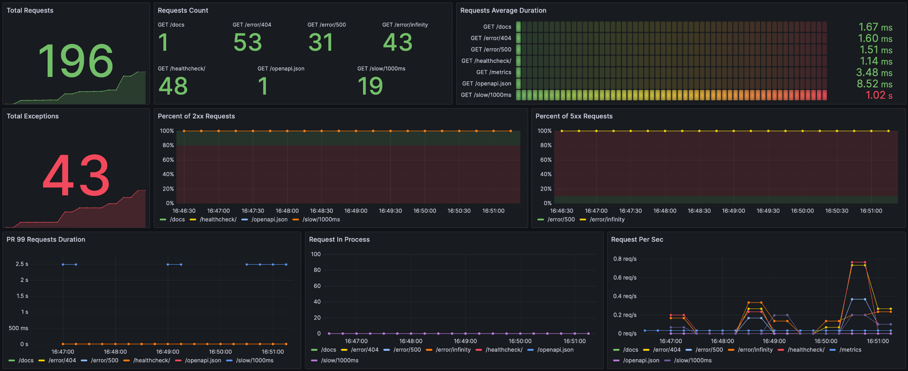

<div align="center">
  <picture>
    <source media="(prefers-color-scheme: dark)" srcset="https://github.com/draincoder/asgi-monitor/blob/develop/docs/logo/asgi-monitor-dark.png?raw=true">
    <source media="(prefers-color-scheme: light)" srcset="https://github.com/draincoder/asgi-monitor/blob/develop/docs/logo/asgi-monitor-light.png?raw=true">
    
  </picture>

  <hr>

  [](https://pypi.python.org/pypi/asgi-monitor)
  [](https://asgi-monitor.readthedocs.io/en/latest/?badge=latest)
  [](https://github.com/draincoder/asgi-monitor/actions/workflows/ci.yaml)
  [](https://pypi.python.org/pypi/asgi-monitor)
  [](https://pypistats.org/packages/asgi-monitor)
  [](https://github.com/draincoder/asgi-monitor/blob/master/LICENSE)

</div>

### A library for easy and fast configuration of logging, tracing and metrics for ASGI applications.

#### Features:
 - [Prometheus](https://prometheus.io) metrics
 - [OpenTelemetry](https://opentelemetry.io) traces
 - [Structlog](https://www.structlog.org/) logging with native **logging** module support
 - Integrations with [Litestar](https://litestar.dev), [FastAPI](https://fastapi.tiangolo.com), [Starlette](https://www.starlette.io) and [Aiohttp](https://docs.aiohttp.org/en/stable/web.html)
 - Logging support for [Uvicorn](https://www.uvicorn.org) and [Gunicorn](https://gunicorn.org) with custom **UvicornWorker**

> [!IMPORTANT]
> At this stage, the library is being tested and be careful in using it,
> your participation in the development will be appreciated!

📚 [Documentation](https://asgi-monitor.readthedocs.io)


### Installation

```shell
pip install asgi-monitor
```

### Quickstart

```python
from asgi_monitor.integrations.fastapi import setup_metrics, MetricsConfig
from fastapi import FastAPI
from uvicorn import run


def run_app() -> None:
   app = FastAPI()
   setup_metrics(app, MetricsConfig(app_name="fastapi"))
   run(app, host="127.0.0.1", port=8000)


if __name__ == "__main__":
   run_app()
```

After setting up, you can see visualization of default metrics in Grafana



The library originates from [structlog-asgi](https://github.com/nkhitrov/structlog-asgi)
